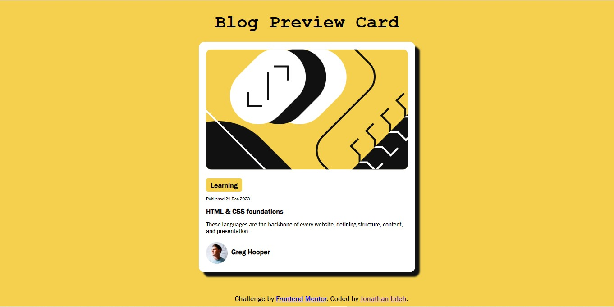

# Blog Preview Card

## Project Overview
This project involves building a Blog preview card, containing introductory details about a blog post. 

## screenshot
- 

## Live Demo
-Live Site url: [Live site url]

## Features
- Blog image displays correctly
- Blog image scales properly
- Blog card conatains label, date, topic and description.
- Blog card contains Author's image and name

## Built with
- Semantic HTML5 markup
- CSS custom properties
- CSS Grid
- Mobile-first workflow

## What I learnt
With this project my css Grid understanding got better and I got to understand more properties of the grid layout, which i didn't understand prior to this project. 

## Continued development
I will be using more of css grid layout as well as flexbox so as to get really familiarize myself with them both even though my flexbox skills are a lot smoother than that of my grid.

## Author
- Twitter - [jaywritescodes]()
- Github - [jonathanudeh]()
- Frontend Mentor - [jonathanudeh]()

## Acknoledgement
Frontend Mentor: Thanks for providing the design and requirements for this project.